# Table of Sections

1. [Activity 1: New Developer on the Project](#activity-1-new-developer-on-the-project)
    1. [Start Copilot Chat in GitHub](#start-copilot-chat-in-github)
    2. [Get Familiar with the Project](#get-familiar-with-the-project)
    3. [Explore Copilot in the CLI inside Codespaces](#explore-copilot-in-the-cli-inside-codespaces)
    4. [Checking data file attached to MongoDB](#checking-data-file-attached-to-mongodb)
    5. [Start backend and front end services](#start-backend-and-front-end-services)
    6. [Learn activity objectives and approach](#learn-activity-objectives-and-approach)
    7. [Locate the listing of wrong name](#locate-the-listing-of-wrong-name)
    8. [Getting listing JSON data](#getting-listing-json-data)
    9. [Update listing name and check](#update-listing-name-and-check) 
2. [Activity 2: New Feature/Requirement](#activity-2-new-featurerequirement)
    1. [Getting activity summary](#getting-activity-summary)
    2. [Identify library and generate test code](#identify-library-and-generate-test-code)
    3. [Improve test code to function](#improve-test-code-to-function)
    4. [Run the test code](#run-the-test-code)
    5. [Update code in IPLocation.js](#update-code-in-iplocationjs)
    6. [Adding doc in IPLocation.js](#adding-doc-in-iplocationjs)
    7. [Explain code in model.controller.js](#explain-code-in-modelcontrollerjs)
    8. [Update http-common.js to pass IP](#update-http-commonjs-to-pass-ip)
    9. [Refresh site](#refresh-site)
    10. [Run script to create PR](#run-script-to-create-pr)
    11. [Generate PR description summary](#generate-pr-description-summary)
3. [Activity 3: Writting Test Cases for 2 Activities](#activity-3-writting-test-cases-for-2-activities)
    1. [Run npm test](#run-npm-test)
    2. [Add test case 1](#add-test-case-1)
    3. [Add test case 2](#add-test-case-2)

# <h1 align="center">Activity 1: New Developer on the Project</h1>

## Start Copilot Chat in GitHub

When you are on this project in browser, you'd have noticed a little Copilot icon next to your GitHub Avatar, on top right corner. 

Click to start a conversation with Copilot Chat in GitHub


:warning: You must on this repository page under `githubuniverseworkshops` in order to see this icon

A new converseation pops up on the right hand side

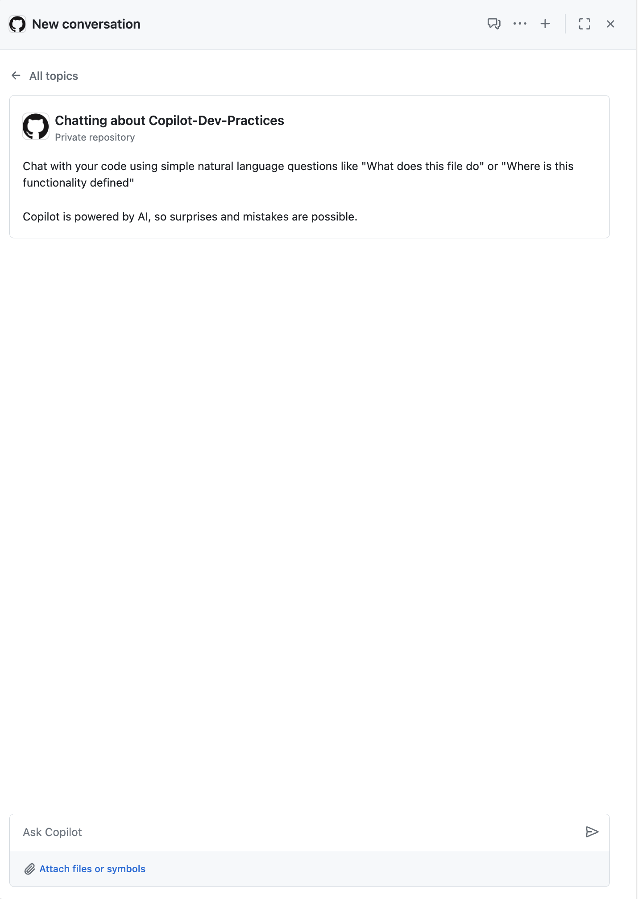

Click  will let you manage threads. You can create and manage multiple threads if you like

Let's start using Copilot Chat in GitHub 🚙

## Get Familiar with the Project
Firstly as a new developer, I'd like to understand more about this project. 

It's great we have a few markdowns here. Add `WORKSHOP.md` as a reference
1. Attach files or symbols -> search and select `WORKSHOP.md`
2. This reference will be used by Copilot Chat in GitHub moving forward

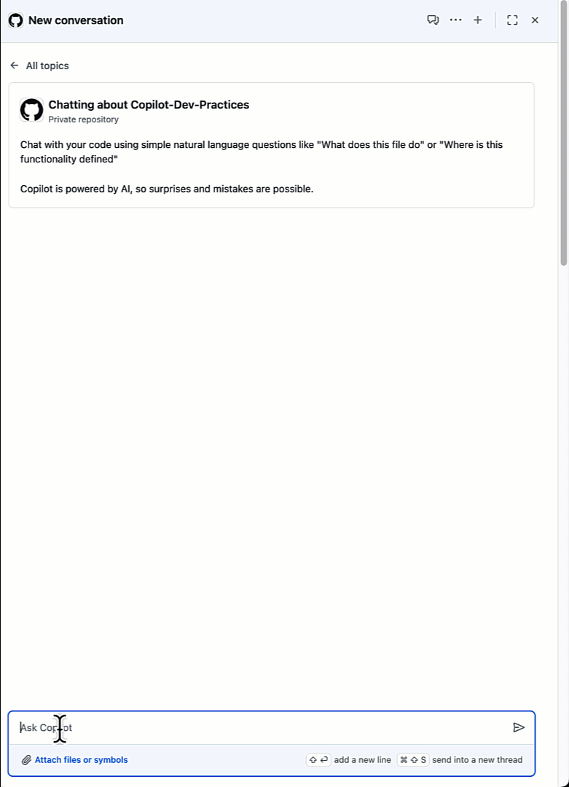


Once done, asking Copilot Chat in GitHub to explain the project.

```
Summarise the WORKSHOP.md in bullet points?
```

Keep asking additional questions, your reference stays unless you click to remove it.

- [ ] Summarise the WORKSHOP.md in bullet points?
- [ ] Explain the project in bullet points?
- [ ] Explain the project in bullet points?
- [ ] Summarise the Technical Details in bullet points?
- [ ] What all is needed for running the project in bullet points?
- [ ] What is MongoDB database and collection name, in bullet points?
- [ ] Which frontend file has the backend uri endpoint?

Based on output from Copilot Chat in GitHub, we learnt that this is a MERN stack, let's get hands-on. We will leverage next tool: Copilot in the CLI

We have prepared a number of scripts which will help you running Copilot in the CLI so you don't have to type yourself 🚀

## Explore Copilot in the CLI inside Codespaces

In this section, let's find if Copilot in the CLI is installed first. In terminal, start typing
```
github-copilot-cli -V
```
:warning: Please open a separate bash inside terminal in order to properly run Copilot in the CLI

If you don't get to see a version number returned. Run ths following to get it installed
```
./scripts/install-copilot-cli.sh
```

Let's try a few commands to check if some services are running. Open script `./scripts/copilot_cli_1.sh` manual or run `code ./scripts/copilot_cli_1.sh` in terminal

You get to see two commands:

```bash
?? Check if node and npm is installed?

?? Check if Mongodb service running use service command?
```

The starting `??` is one of 3 syntaxes of Copilot in the CLI. In command one, we are asking for a shell command that can confirm installation of both Node and NPM; In command two, we check if MongoDB is running.

Now run the script by typing the following in terminal

```
./scripts/copilot_cli_1.sh
```

You should see node and npm versions, and also that MongoDB is running in our environment.

## Checking data file attached to MongoDB

MongoDB requires a JSON formatted dataset to serve as content in our site. As a new Developer, I want to check if this datafile is loaded properly in my MongoDB setup

Open script `./scripts/copilot_cli_2.sh` manual or run `code ./scripts/copilot_cli_2.sh` in terminal

You get to see this command:

```bash
?? Print first 10 Mongodb database sample_airbnb and collection listingsAndReviews
```

The approach of checking is to see whether output of a few sample listing data would work. 

Now run the script by typing the following in terminal

```
./scripts/copilot_cli_2.sh
```

You should see the output data in the command output. With that, let's get the envornment front end and backend up

## Start backend and front end services

As there are mutiple services involved, let's split terminal to manage them seperately. Please rename each terminal as `bash`, `backend` and `frontend` so to differentiate each other

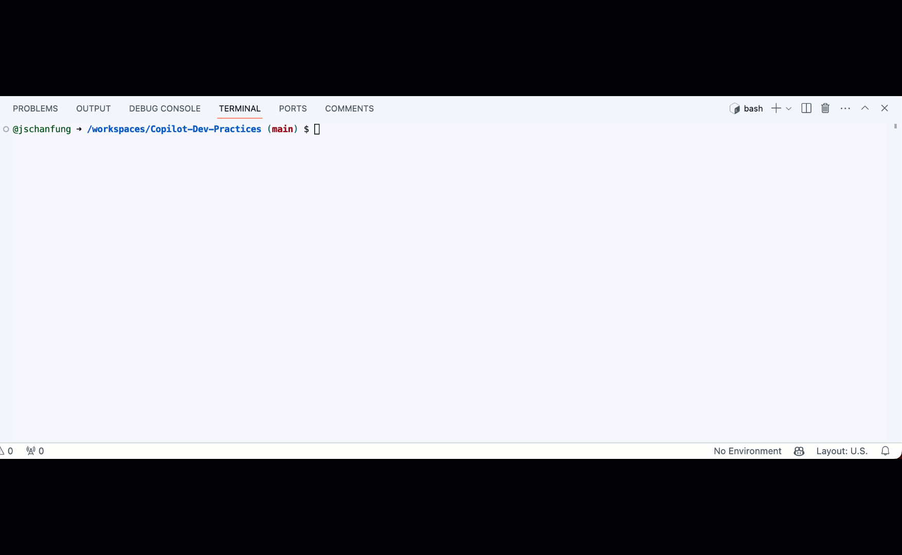

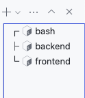

Next we will start backend and frontend services one after another

👉 Select the `backend` terminal, then run:
```
cd backend && npm start
```
👉 Select the `frontend` terminal, then run:
```
cd frontend && npm start
```

Upon completion of frontend starting, you will be prompt by Codespaces to open web URL in a new window, which displays all listings

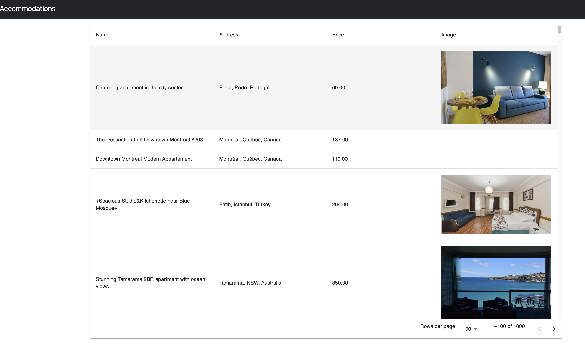

## Learn activity objectives and approach

With the project up and running 🎉. We are ready to make some changes to the project. How long did you take to get familiar with a new project last time?

Continue Copilot Chat in GitHub, with `WORKSHOP.md` selected, ask a few questions about Activity 1:

- [ ] In Section Workshop's Different Developer Activities, summarise Activity 1 in bullet points?
- [ ] In Section Workshop's Different Developer Activities, Activity 1, summarise the fix / requirement for Activity 1 in bullet points?
- [ ] What are different Frontend React Paths available?
- [ ] What are different backend endpoints exposed and unexposed?

## Locate the listing of wrong name

Open script `./scripts/copilot_cli_3.sh` manual or run `code ./scripts/copilot_cli_3.sh` in terminal

You get to see two command:

```bash
?? Get request to http://localhost:8080/api/model with query string search = url encoded UWS Brownstone Near Central Park and store the beautified response in file response.json

?? In response.json print the key id inside listingsAndReviews array
```

In command one, we are asking Copilot in the CLI to construct a API request with specific query string and response format and storing into `response.json`

In command two, we are getting key id for further usage

Now run the script by typing the following in terminal

```
./scripts/copilot_cli_3.sh
```

The key id should be 102995. We will understand more about this particular listing in the next step

## Getting listing JSON data

Let's take a look at listing 102995 in browser. Open a new tab and copy your React App's URL. Then append the default path with `/listings/102995`

You should be able to see a listing page.

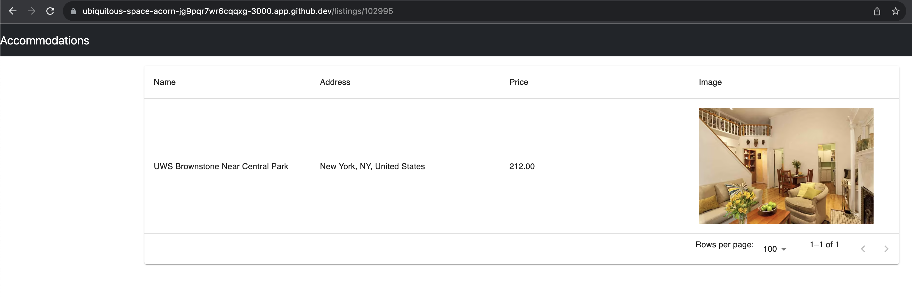

Open script `./scripts/copilot_cli_4.sh` manual or run `code ./scripts/copilot_cli_4.sh` in terminal

You get to see this command:

```bash
?? Get request to http://localhost:8080/api/model/102995 and store the beautified response in file listing.json
```

We are constructing another query for listing 102995 details, then store into `listing.json` to inspect further

Now run the script by typing the following in terminal

```
./scripts/copilot_cli_4.sh
```

Inspecting `listing.json`, we found that key `name` is what we need an update

## Update listing name and check

Open script `./scripts/copilot_cli_5.sh` manual or run `code ./scripts/copilot_cli_5.sh` in terminal

You get to see this command:

```bash
?? Put request to http://localhost:8080/api/model/102995 with JSON data {"name": "UWS Brownstone Prime"}
```

Similar to last one, instead we are making a `PUT` request this time with correct name key value pair

Now run the script by typing the following in terminal

```
./scripts/copilot_cli_5.sh
```

Once complete, switch to the listing UI and refresh. You will see listing name is now corrected.

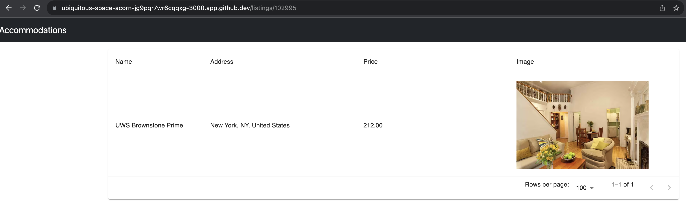

Congrats on completing Activity 1 🏅!


# <h1 align="center">Activity 2: New Feature/Requirement</h1>

## Getting activity summary

Open Copilot Chat in GitHub, select `WORKSHOP.md` then ask 
```
Can you list all the bullet points from Activity 2?
```
You will find that `IP2Location` is to be used, also `Local Geo Location Database` is available for this workshop. We already have put placeholder for you, under the `/backend/geolocation` to build the code and local geolocation database being available.

Let's build with Copilot in Codespaces

## Identify library and generate test code

In Codespaces, use Copilot Chat in IDE to start exploring code. We'd like to get some solid ground first:
```
Share example nodejs geo location packages?
```
Chances are that Copilot Chat does not tell anything about IP2Location, let's try another one specific:
```
Does npm have packages using IP2LOCATION?
```
This time, Copilot Chat tells us that `ip2location-nodejs` is available, and it is able to query IP geolocation information from a local BIN database. Let's see if we can get more details from Copilot Chat:
```
From ip2location NodeJs - Query geolocation information from Local BIN database
```
Copilot Chat would return sample code along with explanation. Let's take the sample code and update `./backend/geolocation/test.js` to begin with
```Javascript
const IP2Location = require("ip2location-nodejs");

// Load the BIN database file
const ip2location = new IP2Location("path/to/database.bin");

// Query the geolocation information for an IP address
const ip = "8.8.8.8";
const result = ip2location.lookup(ip);

// Print the results
console.log(result);
```

## Improve test code to function

We'd like to get more how-tos in the next step, and it's time find some documentation about `IP2Location`. In Codespaces, ask Copilot Chat in IDE:
```
Share the link to npm ip2location-nodejs documentation
```
You should get the link https://www.npmjs.com/package/ip2location-nodejs, now click and open in a new tab.

In the section `Developer Documentation`, click on https://ip2location-nodejs.readthedocs.io/en/latest/index.html

Here we found a very good example to [Query gelocation information from BIN database](https://ip2location-nodejs.readthedocs.io/en/latest/quickstart.html#query-geolocation-information-from-bin-database), copy this code an update `./geolocation/test.js`

You may notice that `ip2location.open` is hitting a file path, we need to replace `./DB26.BIN` with an actual file in our project, which is `.backend/geolocation/IP2LOCATION-LITE-DB3.BIN` inside the repo. Update accordingly. 

You final code should look like below:
```javascript
const {IP2Location} = require("ip2location-nodejs");

let ip2location = new IP2Location();

ip2location.open("./geolocation/IP2LOCATION-LITE-DB3.BIN");

testip = ['8.8.8.8', '2404:6800:4001:c01::67'];

for (var x = 0; x < testip.length; x++) {
	result = ip2location.getAll(testip[x]);
	for (var key in result) {
		console.log(key + ": " + result[key]);
	}
	console.log("--------------------------------------------------------------");
}

ip2location.close();
```

## Run the test code

We can run a quick test on this `test.js`, further by saving the result to a file to inspect. Try the following with Copilot in the CLI:
```
?? run ./backend/geolocation/test.js and save result into ./backend/geolocation/test_result.json
```

Proceed with the recommendation or run `node ./backend/geolocation/test.js > ./backend/geolocation/test_result.json` if you got issues. You will see `./backend/geolocation/test_result.json` appears. Openning that up you might see there are JSON within it but ip is unknown and a bunch of `MISSING_FILE`

That says we can get the response with the expected format. This `test.js` will be a useful reference to Copilot updating actual code inside our project. Let's take a look at that next step.

## Update code in IPLocation.js

While leaving the file `.backend/geolocation/test.js` open(which will help Copilot to use as project reference), find `.backend/geolocation/IP2Location.js` and open in Codespaces

The file should have code look like below
```javascript
// Import the IP2Location module
const { IP2Location } = require("ip2location-nodejs");

// Create a new IP2Location object
const ip2location = new IP2Location();
ip2location.open("./geolocation/IP2LOCATION-LITE-DB3.BIN");

// Export a function for IP geolocation
module.exports.ipLoc = function (IP) {
    // Define function-specific variables
    const _func = "ipLoc";
    const debug = true;
    let result, returnObj;

    // Log debug information
    if (debug) {
        console.log(`${_func}: entry`);
    }

    try {        
        {
            //START:TODO - GeoLocation Logic to Implement

            
            //END:TODO
        }        

    } catch (err) {
        // Log any errors that occur
        console.log(`${_func}: error -> ${err}`);
    }
};
```

You will see a code block `START:TODO` and `END:TODO`, let's start coding with Copilot prompts. Remove these comment, then start typing below
```
//Find the geolocation using the IP input from the local file, and return ip, country and city
```

Press `ENTER`, Use Copilot will start generating code, press `TAB` to accept, then `ENTER` to next line. 

Keep pressing `ENTER` on empty line, Copilot will cover logging and returning of object both comment and code generation. You should see something like below:

```javascript
    try {        
        {
            //Find the geolocation using the IP input from the local file, and return ip, country and city
            result = ip2location.getAll(IP);
            returnObj = {
                ip: IP,
                country: result.country_short,
                city: result.city
            };

            // Log debug information
            if (debug) {
                console.log(`${_func}: result -> ${JSON.stringify(returnObj)}`);
            }

            // Return the object
            return returnObj;
        }        

    } catch (err) {
        // Log any errors that occur
        console.log(`${_func}: error -> ${err}`);
    }
```

## Adding doc in IPLocation.js

Brilliant! We got some code, but before we move to next, let's make `IPLocation.js` better by adding some docs.

It's a boring task right? Let's see what Copilot can do for you

Stay on `IPLocation.js`, click line 1. Then type the following key combinations:
- On `Mac`: Key in `Cmd+I`
- On `Windows`: TODO

This is the shortcut to command Copilot 💻! Now type `/doc` and `ENTER`


Wooa! Copilot generates some docs for you based on the new code we just added. It also asks for your review. Click `Accept` button. 

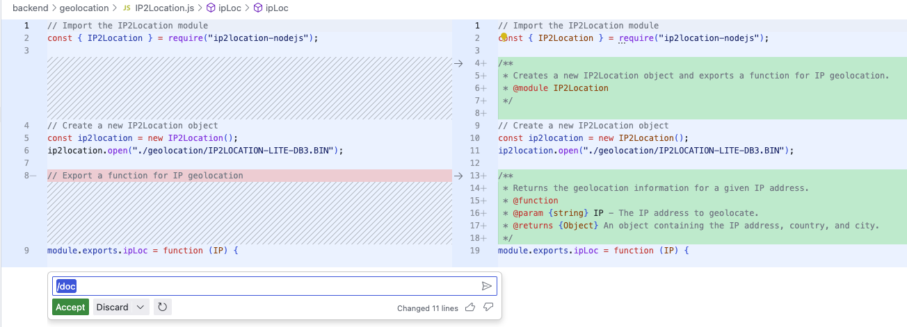

You final version of `IPLocation.js`

```javascript
/**
 * IP2Location module for geolocation.
 * @module IP2Location
 * @requires ip2location-nodejs
 * @see {@link https://www.npmjs.com/package/ip2location-nodejs|ip2location-nodejs}
 */

// Import the IP2Location module
const { IP2Location } = require("ip2location-nodejs");

// Create a new IP2Location object
const ip2location = new IP2Location();
ip2location.open("./geolocation/IP2LOCATION-LITE-DB3.BIN");

/**
 * Function for IP geolocation.
 * @function ipLoc
 * @param {string} IP - The IP address to geolocate.
 * @returns {Object} An object containing the geolocation information for the given IP address.
 * @property {string} ip - The IP address that was geolocated.
 * @property {string} country - The country where the IP address is located.
 * @property {string} city - The city where the IP address is located.
 */
module.exports.ipLoc = function (IP) {
    // Define function-specific variables
    const _func = "ipLoc";
    const debug = true;
    let result, returnObj;

    // Log debug information
    if (debug) {
        console.log(`${_func}: entry`);
    }

    try {        
        {
            //Find the geolocation using the IP input from the local file, and return ip, country and city
            result = ip2location.getAll(IP);
            returnObj = {
                ip: IP,
                country: result.country_short,
                city: result.city
            };

            // Log debug information
            if (debug) {
                console.log(`${_func}: result -> ${JSON.stringify(returnObj)}`);
            }

            // Return the object
            return returnObj;
        }        

    } catch (err) {
        // Log any errors that occur
        console.log(`${_func}: error -> ${err}`);
    }
};

```
## Explain code in model.controller.js

We learnt previously that you can command Copilot to geenrate doc. Let's try another command this time. 

Open `/backend/app/controllers/model.controller.js`, search in the file START:TODO

Select the code block below it, then key in `Cmd+I`, type `/explain` then enter.

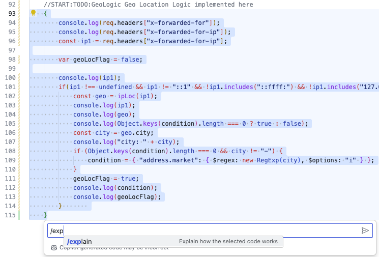

The command `/explain` is passed to Copilot Chat in IDE for an answer. Very handy isn't it?

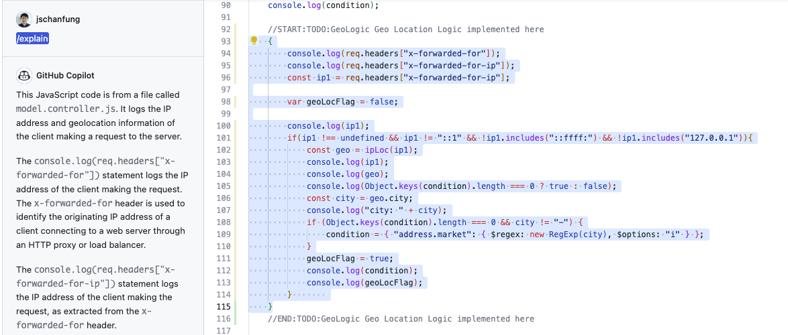

## Update http-common.js to pass IP

Now we are getting close to completing all changes 🦾. One thing left is to update `/frontend/src/http-common.js` 

You will see a list of commented `x-forwarded-for-ip`, uncomment one of them so we can pass IP in the request header.

## Refresh Site

Restart backend service by `Ctrl + c` then `npm start`

Refreshing the site. Depending on which `x-forwarded-for-ip`, the listing is now shortlisted

## Run script to create PR

With that, we are comfortable to push our changes back. There is a script prepared for you. Run `code ./scripts/git_branch_push.sh` to open the script file to have a look

What it does:
1. creating a feature branch `geo-location-logic`
2. carrying all the changes we introduced(new files such as `test.js` won't be added, only changes to existing project files)
3. push to remote branch of the same name

Run the script by running `./scripts/git_branch_push.sh`

## Generate PR description summary

Get back to your project repo on GitHub UI, you should be able to see a prompt asking you creating a Pull Request for branch `geo-location-logic`

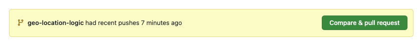

Click to proceed, we want to write something about this PR. In real projects, this is almost essential to reviewers. Can GitHub Copilot help? That answer is possitive ✨

You will notice description editor now also empowered with Copilot Icon. This is where you can access Copilot for PR on writing description. Click the icon then the summary

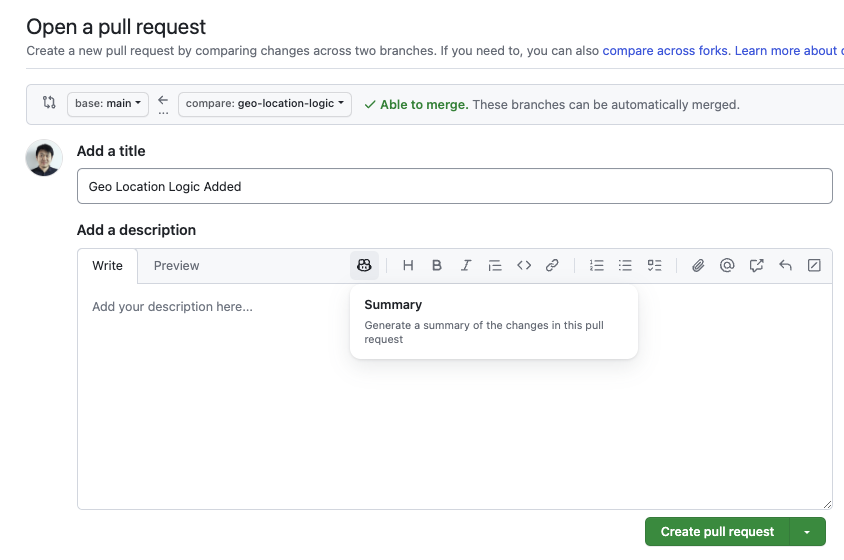

Copilot will take sometime to extract code changes, together with project contexts, and generate description ready for you!

Once ready, create the PR and merge it and we are done in Activity 2 🎉

# <h1 align="center">Activity 3: Writting Test Cases for 2 Activities</h1>

## Run npm test

In Codespaces, ensure your current folder is `backend`. Run the following to execute unit test

```
npm test
```

You will get to see a summary of test cases and result of each. Also you noticed there is a test file `test/endpoint.test.js` under `backend` folder.

## Walk through `model.routes.js`

Open test file `code app/routes/model.routes.js`

You will see it requires `../controllers/model.controller.js` and it contains a couple of get functions. With one to return all listings and another to return a specific listing

## Add test case 1

Open test file `code test/endpoint.test.js`, search `//Test Case 1 - TODO:`

Select this line or below, then key in `Cmd+i` to open Copilot command prompts. We are asking Copilot to generate test case this time via `/tests`. Enter the following:

```
/tests unit test - GET /api/model/{id} where id=102995, parse JSON response.text, and check name="UWS Brownstone Prime"
```

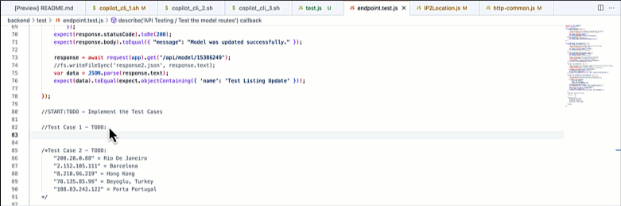

Similar to the `/docs` experience, Copilot generates test case. Review and accept.

Run `npm test` in terminal you will see how the newly added test case work

:information_source: It's OK your unit test fails with generated code.

## Add test case 2

Stay on test file `code test/endpoint.test.js`, search `//Test Case 2 - TODO:`

Select this line or below, then key in `Cmd+i` to open Copilot command prompts. We are asking Copilot to generate test case this time via `/tests`. Enter the following:

```
/tests unit test - GET /api/model/ set x-forwarded-for-ip header 8.210.96.219, parse JSON response.text, and loop through array listingsAndReviews
```

You will need to replace IP `8.210.96.219` depending on your choice of city in Activity 2

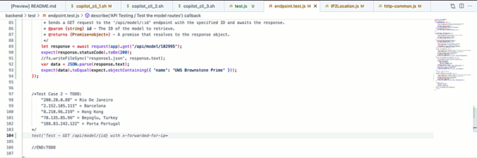

Again review the generated test case and accept.

Re-run `npm test` to see that a new unit test got added.

:information_source: It's OK your unit test fails with generated code.

Congratulations on completing Activity 3 :mortar_board: