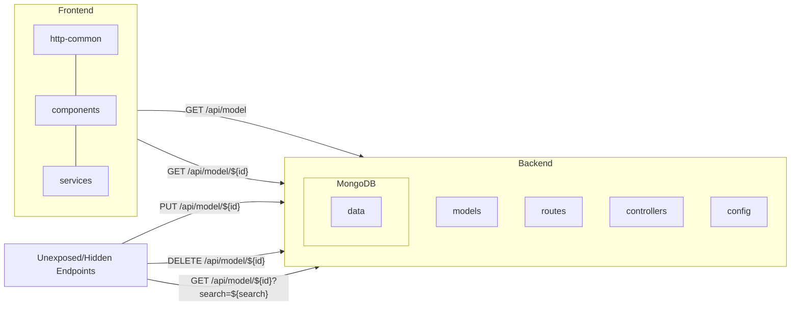

# Project Name

Accommodation Listings

## Project Description

The Project lists all the accommodations we our contracted with Airbnb. As our teams need to travel regularly to global locations and reserve accommodations on these available listings. 

The Project is build on MERN stack is a JavaScript-based software stack used to build web applications. MERN stands for [MongoDB](https://docs.mongodb.com/), [Express](https://expressjs.com/), [React](https://reactjs.org/), and [Node.js](https://nodejs.org/en/docs/), which are the four technologies that make up the stack.

When used together, these technologies provide a complete framework for building scalable and responsive web applications. Node.js and Express are used for the server-side and back-end programming, while React is used for the client-side and front-end programming. MongoDB is used to store and manage data.

This stack is widely used because it is relatively simple to learn, uses a common programming language (JavaScript), and can be used to build complex and robust web applications.

## Table of Contents

1. [Technical Details](#technical-details)
2. [Installation](#installation)
3. [Usage](#usage)
4. [Contributing](#contributing)

## Technical Details

The Project is broken down into two main parts:
1. **Backend**: Which has been build on NodeJS, ExpressJS and MongoDB, and the source code is available in the [backend](./backend) folder. Following are the important part of backend:
   1. The Project follows the standard ExpressJS [folder structure](https://expressjs.com/en/starter/generator.html)
   2. [Mongodb's Airbnb sample dataset](https://www.mongodb.com/docs/atlas/sample-data/sample-airbnb/) json is located at [/mongodb-dataset/sample_airbnb.json](./mongodb-dataset/sample_airbnb.json) & Schema is located at [airbnb-schema.json](./backend/app/models/schemas/airbnb-schema.json)
   3. [Config](./backend/app/config) - Contains all the ExpressJS global variables and mongodb db connection details
   4. [Models](./backend/app/models) - Sets up the connectivity to MongoDB with Pagination and also contains the Schemas
   5. [Routes](./backend/app/routes) - Exposes the routes and paths with different HTTP verbs 
   6. [Controllers](./backend/app/controllers) - Implementation for the different routes and logic for each Endpoints / APIs
   7. Backend endpoints which are exposed are:
      1. Endpoints / APIs exposed to Frontend:
         - GET `/api/model` - Returns all the listings
         - GET `/api/model/${id}` - Returns the specific listing
      2. Endpoints / APIs hidden and unexposed to Frontend:
         - GET `/api/model/${id}?search=${search}` - Search a listing using the query string.
         - PUT `/api/model/${id}` - Returns the specific listing & specify only the specific fields to be updated
         - DELETE `/api/model/${id}` - Returns the specific listing

3. **Frontend**: Which has been build on ReactJS basic setup, to display the listings, and the source code is available in the [frontend](./frontend) folder. Following are the important part of frontend:
   1. The Project follows the standard React Web App [folder structure](https://create-react-app.dev/docs/folder-structure)
   2. [http-common.js](./frontend/src/http-common.js) - Uses Axios to hit the backend endpoint
   3. [listing.component.js](./frontend/src/components/listing.component.js) - Uses React and Mui tables to display the listing
   4. [listing.service.js](./frontend/src/services/listing.service.js) - Makes the API call to the appropriate backend paths and with query strings & headers
   5. React paths available in the frontend:
      1. `/` or `/listings/`- Displays all the listings
      2. `/listings/${id}` - Displays the specific listing

## Installation

Following are the steps to install the project:
1. Install [Node.js](https://nodejs.org/en/download) verion >= 18, and [npm](https://docs.npmjs.com/downloading-and-installing-node-js-and-npm) >= 9
2. Install [MongoDB](https://www.mongodb.com/docs/manual/installation/) >= 3.6
3. [MongoDB Command Line Database Tools](https://www.mongodb.com/try/download/database-tools)
4. [mongoimport](https://www.mongodb.com/docs/database-tools/mongoimport/#mongodb-binary-bin.mongoimport) the [Mongodb's Airbnb sample dataset](https://www.mongodb.com/docs/atlas/sample-data/sample-airbnb/) and collection `listingsAndReviews` to the local mongodb
5. Install the Frontend by running `npm install` inside `./frontend`
6. Install the Backend by running `npm install` inside `./backend`

## Usage

Run the following steps to run each part:
1. Backend
   - run `npm start` inside the `./backend` folder
2. Frontend
   - run `npm start` inside the `./frontend` folder

## Contributing

Thank you for considering contributing to our project! Please follow these guidelines before submitting a pull request:
1. Fork the repository and make your changes on the development branch.
2. Make sure your code is properly formatted and adheres to our coding standards.
3. Write clear and concise commit messages and include documentation with your changes.
4. Push your changes to your fork and submit a pull request to the development branch of the original repository.
5. Please allow time for our team to review your changes and provide feedback.
6. Once your pull request is approved, we will merge your changes into the master branch.

By contributing to this project, you agree to follow the [code of conduct](/CODE_OF_CONDUCT.md) outlined in the project's repository. Please report any inappropriate behavior to [project maintainers](dhruvg20@github.com).

We appreciate your time and effort in contributing to this project!

## License

[MIT licensed](./LICENSE).

## Credits

We like to thank the following projects and sources which have helped us build this project:
1. [Sample AirBnB Listings Dataset](https://www.mongodb.com/docs/atlas/sample-data/sample-airbnb/)
