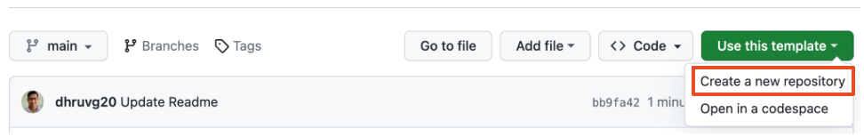
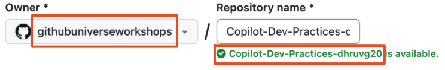
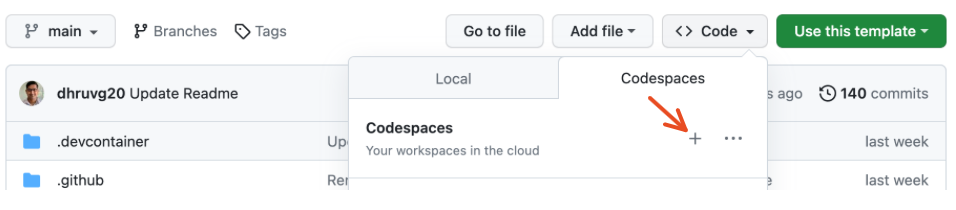

<h1 align="center">GitHub Copilot lead to improvement in development practices</h1>
<h5 align="center">@jschanfung & @dhruvg20</h3>

  <a href="#learning-objectives">Learning Objectives</a> •  
  <a href="#mega-prerequisites">Prerequisites</a> •  
  <a href="#construction-setup">Setup</a> •  
  <a href="#mega-post-requisites">Post-requisites</a> •  
  <a href="#-acknowledgement--open-source">Acknowledgement & Open source</a> •  
  <a href="#books-resources">Resources</a>

> Please provide a description of your workshop.

- **Who is this for**: - Developers, Leads and Project Managers who are interested in learning how to use GitHub Copilot to improve development practices.
- **What you'll learn**: GitHub Copilot can help your team be more productive, stay in flow, and be more satisfied with their work in all areas of the Software Development Cycle. 
- **What you'll build**: You will take on different development personas and work on a MERN project to fix, build, and test specific use cases, and build the environment for it. 

## Learning Objectives

In this workshop, you will:

  - GitHub Copilot AI can be used to improve development practices.
  - Understand the importance to consider the specific needs of your team and organization when adopting AI tools.
  - Gain insight into the creative aspects of GitHub Copilot which will help improve developer experience.

## :mega: Prerequisites
Before joining the workshop, there are a few items that you will need to install or bring with you.
1. GitHub Account - Please have one ready or create before the workshop. **This handle must be a public github account registered via github.com**
2. Accepted the Universe 23 Organization `githubuniverseworkshops` invite to your Workshop Project - `githubuniverseworkshops/Copilot-Dev-Practices-[your_handle]`
3. If you have not received an invite for step 2, then proceed and do step 4 and 5. If you have received an invite and successfully accessed your Project - `githubuniverseworkshops/Copilot-Dev-Practices-[your_handle]`, please skip to step 6.
4. Use this template, and create a new Project/Repository in the same Organization to get all the features available. As seen below. 

&nbsp;&nbsp;&nbsp;5. Give the new project the name same as the current Project with "-[your-github-handle]". 
 &nbsp;&nbsp;&nbsp;&nbsp;&nbsp;&nbsp;&nbsp;&nbsp;&nbsp;&nbsp;Example: Copilot-Dev-Practices-dhruvg20
  

&nbsp;&nbsp;&nbsp;6. Once you have access to your Project/Repository. Go ahead and create a new Codespaces by click the below seen "+" sign, in your Project/Repository

&nbsp;&nbsp;&nbsp;7. Please go through workshop details -

&nbsp;&nbsp;&nbsp;&nbsp;&nbsp;&nbsp;&nbsp; [WORKSHOP.md](./WORKSHOP.md)

&nbsp;&nbsp;&nbsp;8. Access to step-by-step guide -

&nbsp;&nbsp;&nbsp;&nbsp;&nbsp;&nbsp;&nbsp; [EXERCISE.md](./EXERCISE.md)

## :construction: Setup
Please head to the [Workshop Setup](./WORKSHOP.md#workshop-setup) Section of the [WORKSHOP.md](./WORKSHOP.md) to initialise your workshop environment.

## :mega: Post-requisites
This Repository would be deleted on 25th Nov 2023. Please create a backup of this Repository.

## 🙏 Acknowledgement & Open source
1. [MongoDB Sample AirBnB Listings Dataset](https://www.mongodb.com/docs/atlas/sample-data/sample-airbnb/)
2. [IP2Location](https://www.ip2location.com/) & [IP2Location Node.js Library](https://ip2location-nodejs.readthedocs.io/en/latest/)

## :books: Resources
- [GitHub Copilot - Your AI pair programmer](https://github.com/features/copilot)
- [GitHub Copilot X - Your AI pair programmer is leveling up](https://github.com/features/preview/copilot-x)
- [What is the MERN stack?](https://www.mongodb.com/mern-stack)
