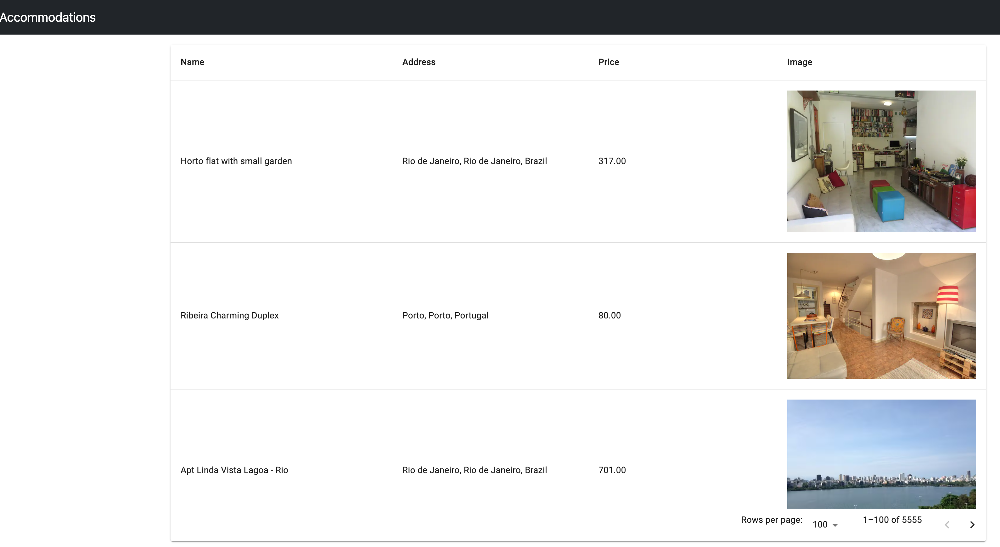
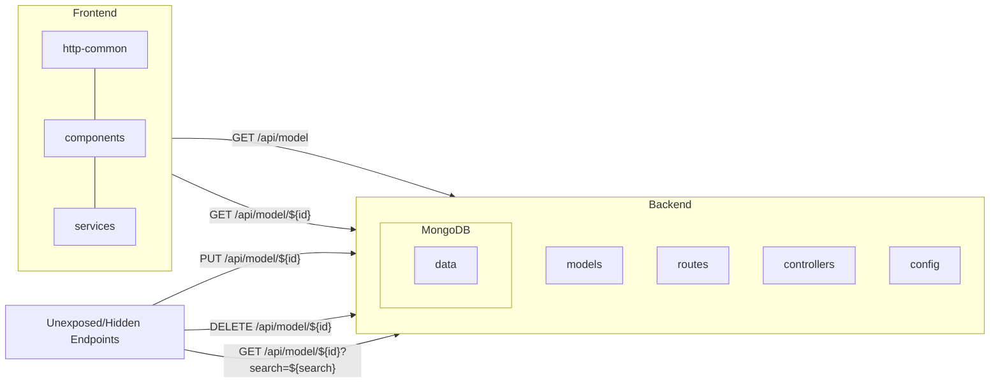
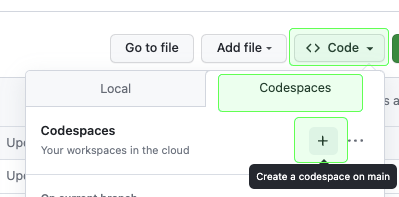
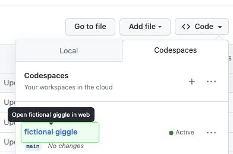
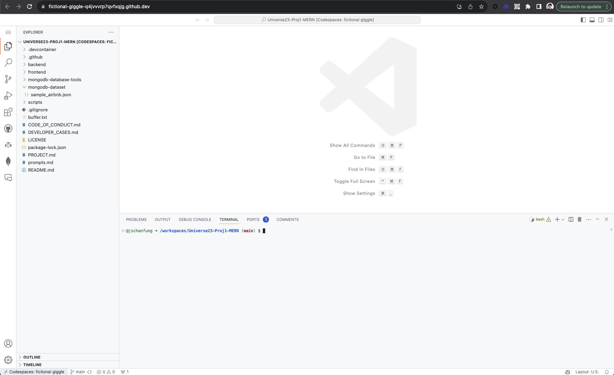
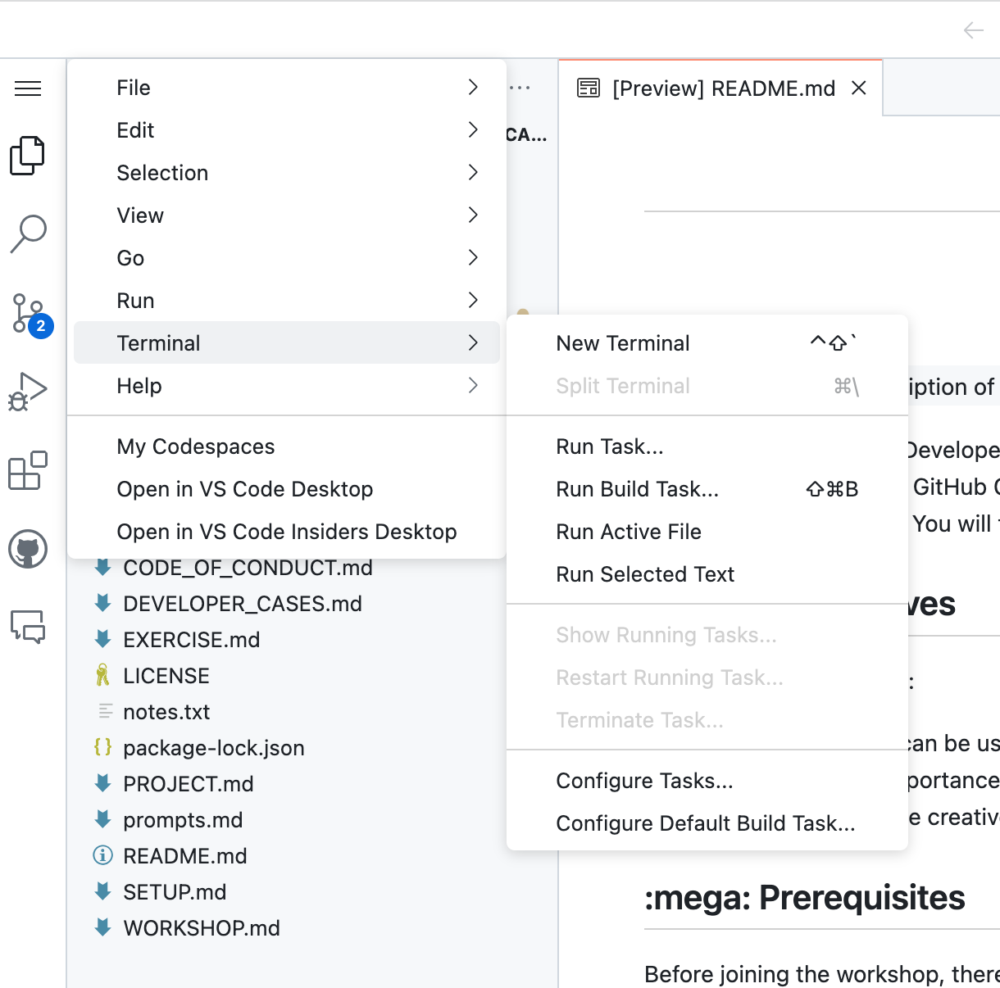
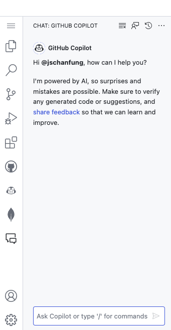
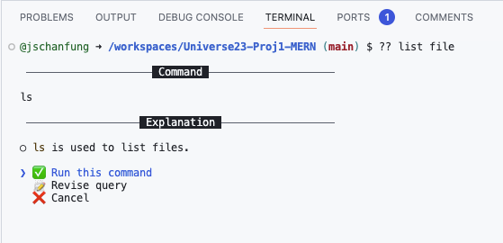
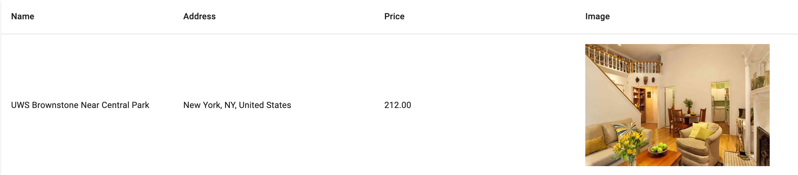

# Table of Sections
1. [Project Details](#project-details)
2. [Workshop Setup](#workshop-setup)
3. [Workshop's Different Developer Activities](#workshops-different-developer-activities)

## Project Details

## Project Name

Accommodation Listings

## Project Description

The Project lists all the accommodations we our contracted with Airbnb. As our teams need to travel regularly to global locations and reserve accommodations on these available listings. 

The Project is build on MERN stack is a JavaScript-based software stack used to build web applications. MERN stands for [MongoDB](https://docs.mongodb.com/), [Express](https://expressjs.com/), [React](https://reactjs.org/), and [Node.js](https://nodejs.org/en/docs/), which are the four technologies that make up the stack.

When used together, these technologies provide a complete framework for building scalable and responsive web applications. Node.js and Express are used for the server-side and back-end programming, while React is used for the client-side and front-end programming. MongoDB is used to store and manage data.

This stack is widely used because it is relatively simple to learn, uses a common programming language (JavaScript), and can be used to build complex and robust web applications.

## Table of Contents

1. [Technical Details](#technical-details)
2. [Installation](#installation)
3. [Usage](#usage)
4. [Contributing](#contributing)

## Technical Details

The Project is broken down into two main parts:
1. **Backend**: Which has been build on NodeJS, ExpressJS and MongoDB, and the source code is available in the [backend](./backend) folder. Following are the important part of backend:
   1. The Project follows the standard ExpressJS [folder structure](https://expressjs.com/en/starter/generator.html)
   2. [Mongodb's Airbnb sample dataset](https://www.mongodb.com/docs/atlas/sample-data/sample-airbnb/) json is located at [/mongodb-dataset/sample_airbnb.json](./mongodb-dataset/sample_airbnb.json) & Schema is located at [airbnb-schema.json](./backend/app/models/schemas/airbnb-schema.json)
   3. [Config](./backend/app/config) - Contains all the ExpressJS global variables and mongodb db connection details
   4. [Models](./backend/app/models) - Sets up the connectivity to MongoDB with Pagination and also contains the Schemas
   5. [Routes](./backend/app/routes) - Exposes the routes and paths with different HTTP verbs 
   6. [Controllers](./backend/app/controllers) - Implementation for the different routes and logic for each Endpoints / APIs
   7. Backend endpoints which are exposed are:
      1. Endpoints / APIs exposed to Frontend:
         - GET `/api/model` - Returns all the listings
         - GET `/api/model/${id}` - Returns the specific listing
      2. Endpoints / APIs hidden and unexposed to Frontend:
         - GET `/api/model/${id}?search=${search}` - Search a listing using the query string.
         - PUT `/api/model/${id}` - Returns the specific listing & specify only the specific fields to be updated
         - DELETE `/api/model/${id}` - Returns the specific listing

3. **Frontend**: Which has been build on ReactJS basic setup, to display the listings, and the source code is available in the [frontend](./frontend) folder. Following are the important part of frontend:
   1. The Project follows the standard React Web App [folder structure](https://create-react-app.dev/docs/folder-structure)
   2. [http-common.js](./frontend/src/http-common.js) - Uses Axios to hit the backend endpoint
   3. [listing.component.js](./frontend/src/components/listing.component.js) - Uses React and Mui tables to display the listing
   4. [listing.service.js](./frontend/src/services/listing.service.js) - Makes the API call to the appropriate backend paths and with query strings & headers
   5. React paths available in the frontend:
      1. `/` or `/listings/`- Displays all the listings
      2. `/listings/${id}` - Displays the specific listing

## Installation

Following are the steps to install the project:
1. Install [Node.js](https://nodejs.org/en/download) verion >= 18, and [npm](https://docs.npmjs.com/downloading-and-installing-node-js-and-npm) >= 9
2. Install [MongoDB](https://www.mongodb.com/docs/manual/installation/) >= 3.6
3. [MongoDB Command Line Database Tools](https://www.mongodb.com/try/download/database-tools)
4. [mongoimport](https://www.mongodb.com/docs/database-tools/mongoimport/#mongodb-binary-bin.mongoimport) the [Mongodb's Airbnb sample dataset](https://www.mongodb.com/docs/atlas/sample-data/sample-airbnb/) and collection `listingsAndReviews` to the local mongodb
5. Install the Frontend by running `npm install` inside `./frontend`
6. Install the Backend by running `npm install` inside `./backend`

## Usage

Run the following steps to run each part:
1. Backend
   - run `npm start` inside the `./backend` folder
2. Frontend
   - run `npm start` inside the `./frontend` folder

## Contributing

Thank you for considering contributing to our project! Please follow these guidelines before submitting a pull request:
1. Fork the repository and make your changes on the development branch.
2. Make sure your code is properly formatted and adheres to our coding standards.
3. Write clear and concise commit messages and include documentation with your changes.
4. Push your changes to your fork and submit a pull request to the development branch of the original repository.
5. Please allow time for our team to review your changes and provide feedback.
6. Once your pull request is approved, we will merge your changes into the master branch.

By contributing to this project, you agree to follow the [code of conduct](/CODE_OF_CONDUCT.md) outlined in the project's repository. Please report any inappropriate behavior to [project maintainers](dhruvg20@github.com).

We appreciate your time and effort in contributing to this project!

## License

[MIT licensed](./LICENSE).

## Credits

We like to thank the following projects and sources which have helped us build this project:
1. [Sample AirBnB Listings Dataset](https://www.mongodb.com/docs/atlas/sample-data/sample-airbnb/)

 

# Workshop Setup

To ensure the best experience during this workshop, please follow the steps in this instruction to get your environment up

## Configure Codespaces

[GitHub Codepsaces](https://github.com/features/codespaces) is a development environment that's hosted in the cloud. It supports customisation by configuring dev container for your repository, to define a choice of different development environments that are appropriate for the work people will do in your repo.

### :wrench: Create your own Codespace instance

Inside your personal workshop repo(NOT the repo template your create this repo from), find `Code`, Select `Codespaces Tab`, then click the `+` to create a new Codespace instance. A new Tab will prompt and you should start seeing progress in Codespace preparation.

ℹ️ It generally takes a few minutes to get your Codespace ready for use  
ℹ️ Although GitHub Codespaces supports a variety of IDE enginee, we will be using Visual Studio Code in this workshop(which is also the default choice) 
ℹ️ Every Codespaces instance comes with a name randomly selected by GitHub during creation 

### :question: What if I accidentally closed Codespace tab?

If you closed the Codespace tab in your browser, you can always resume it. On your repo main page, locate recent Codespace instance via `Code` -> `Codespace Tab`, click the instance name will pop up the Codespace environment.

## Check GitHub Copilot Features

Your Codespace instance should look like below once it is ready

📣 **Note** - Please close all the Open terminals inside your codespaces on starting it.  You can start a new code space by hitting the short cut **Ctrl + Shift + `**, OR by using the GUI option seen below:

### :speech_balloon: Check out Copilot Chat

Notice the side bar from left-hand, there is a  icon, click you will enter Copilot Chat in IDE. We will learn how Copilot Chat helps us during the workshop.

### :mag: Check out Copilot in the CLI

Just like local VS Code, Codespaces also comes with terminal for command inputs. In this repository we already installed Copilot in the CLI. Try type something starting with `??`, for example, `?? list file`. Copilot in the CLI will return command suggestion. Feel free to accept or cancel using your keyboard arrows.

# <h1 align="center">Workshop's Different Developer Activities</h1>

<h3 align="left">Activity 1: New Developer on the Project</h3>

Welcome to the team. You are the new team member to this business project. You have been in the Company for few years, but have just shifted to this project. You understand the MERN stack, and have worked few production projects in the past.

We have a low / non-critical severity fix come in from one of the Business Owners of the project, and it is being tracked on our Project Board. As you know we are low on staff due to vacations in the team, and we need you to pick up this requirement and start working on it. This being a non-critical fix, and it will help you get familiar with the project and the code base. 

<h4 align="left">Fix / Requirement:</h4>
One of our listers in New York city, has rebranded his Listing, and has requested us to update the Listing Name on our website. This Old Name is `UWS Brownstone Near Central Park` and the new name needs to updated to `UWS Brownstone Prime`.

   

<h3 align="left">Activity 2: Developer experienced on the Project - New Feature / Requirement</h3>

Hi, It is exciting to be working again with you on this new requirements. This is High Severity requirement, and we need to get this done in this Quarter. This requirement can improve the client experience and help them to see their listings in their geographical location.

<h4 align="left">New Feature / Requirement: Geo Location based displaying listings</h4>
Our Sales employees log in from different locations across the globe. They have clients, partners, vendors and franchise owners visiting their locations quite often. Today they access the Accomodation page and need to manually find different listings specific to their location. We would like you and your team to build a solution which displays only their listings based on their Geo Location. We have partnered with a Geo Location service in the past, and would request you to use the same location to build a working prototype. Our website is protected by the leading Content Delivery Network(CDN) and you could use their features for building your solution.  

Our Sister Company is using [IP2LOCATION](https://www.ip2location.com/) and for this prototype we would like you to use the same service. 

   

<h3 align="left">Case 3: Writing a Test cases for the above 2 Use cases</h3>

1. **Test Case 1** - Check the Listing based on the ID, and check if it's name has been correctly changed to `UWS Brownstone Prime`.

2. **Test Case 2** - Check if Geo Location logic implementation is working as desired

